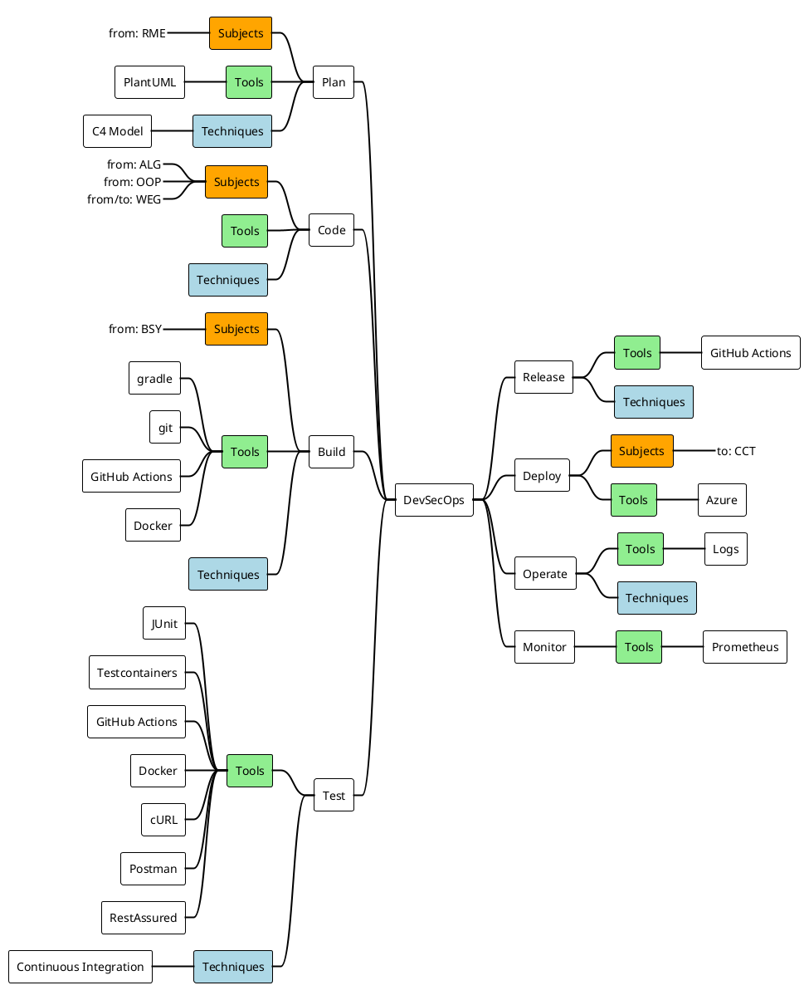

As Engineer you need to think of a thousand things. To not lose oversight we need a guiding thread (🇩🇪 _roter Faden_). Our Guiding Thread is the DevSecOps eight or ∞ _visualization_. Every bit of information we learn can be tied to the DevSecOps _eight_.

## Mindmap

:::note
This mindmap is code too, check it out by clicking **Edit this page** at the bottom!
:::

