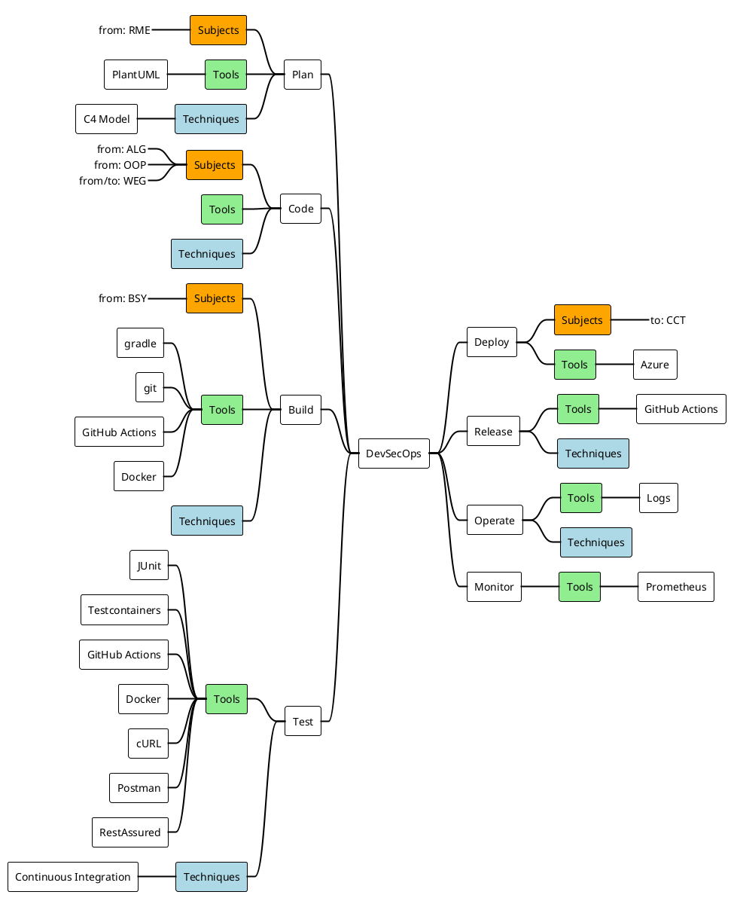

As an engineer you need to think of a thousand things. To not lose oversight we need a guiding thread (🇩🇪 _roter Faden_). Our Guiding Thread is the DevSecOps eight or ∞ _visualization_. Every bit of information we learn can be tied to the DevSecOps _eight_.

This thread has been chosen due to its importance in modern day software development and its close relation to practice. You can learn about DevOps in the [first theory lesson](theory/devops).

## Goal
Every single lecture (one lecture block, 45min) has its own goal. Also, each task has a goal. The summary of all these goals is:

:::info
You achieve an E profile. You know every aspect of a Software Engineers daily work and can either reason why you did not do something, apply a minimum viable approach or deep-dive and implement a sophisticated solution. You know for every aspect the foundational theory, the techniques and the tools that can support you. You can do this with security and the customer in mind and you can work with, and not hidden, from other roles.
:::

While DevOps talks mainly about development and operations there is way more to being a capable and valued engineer in the 21st century:

* They plan, code build and test their product (Dev)
* They deploy, release, monitor and operate their own makings (Ops)
* They work closely with the product team, understanding from them the business needs
* They work closely with the user experience team in order to implement what the user needs or wants and not what they seem fit in their chamber
* They keep their application secure and up to date. _"Security first"_ and _"customer first"_ approaches go hand in hand as no customer ever said: _I want this but preferably insecure..._ 🤦🏽‍♀️

For every lecture and task we do we will elaborate - using the [mindmap](#mindmap) below - how the just learned content fits into the skill set described.

### Disclaimer
Of course, there are companies or cultures where one aspect of engineering is more needed or encouraged than another. We want to achieve an `E` profile with the possibility to drill down, not a `T` profile where one needs to evolve out of.

## Mindmap

To better tie the goals together and provide a thread for the lecture a mindmap has been drafted. On this mindmap you find for every _phase_ of DevOps the necessary links towards techniques and tools. Also you can see which subjects knowledge you need to apply or transfer. The theory is not linked explicitly, you can derive the theory from the techniques.

As one can see, the _Ops_ part is less mature or evolved than the _Dev_ aspects. This is due to the fact that the time is limited and one can argue that everyone that wants to run something first needs to build it 😏

:::note
This mindmap 👆🏽 is code too, check it out by clicking **Edit this page** at the bottom!
:::