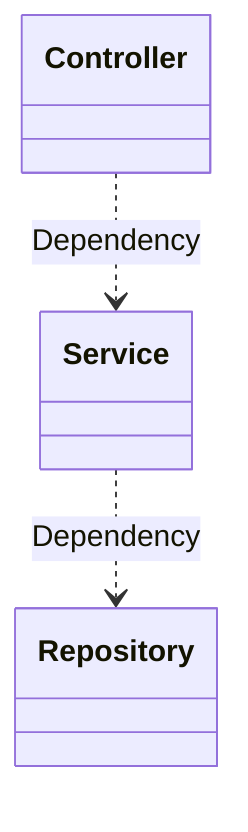

:::info Metadata
|Lecture equivalent| Duration |
|-|-|
|5| 3h 45min |

At the end of this task, students

* have analysed and deepened their knowledge on microservices
* have re-visited and iterated their diagrams from the [C4 ExMan](c4-exman) task - weaving in the new architecture knowledge
* have added a three-layer scaffolding to their [spring-starter](spring-starter) - let us name it _small monolith_
:::

## Deepen microservice knowledge

We will not apply microservices in this lecture. The overhead they generate is only acceptable if certain other requirements are fulfilled. None the less it is important to be familiar with the concept.

:::note Task
Read [Hexagonal Architecture](/docs/techniques/hexagonal-architecture).
:::

## Iterate the diagrams
You have enjoyed 90 minutes about `architecture`. Funnel this knowledge now into your two diagrams from [C4 ExMan](c4-exman).


:::note Task

1. Book a time slot with a fellow student of 30 min
2. Revisit **your** diagrams from [C4 ExMan](c4-exman), challenge them both ways with your colleague and iterate over them, applying your latest knowledge onto them
3. Write down the findings
4. Correct the findings and document them properly

We are again not aiming for the perfect diagram, we are learning once more one of our principles: [**Iterate**](/docs/theory/principles#iterate) - this time with a buddy!

To complete this task you are expected to hand in:

* Name of your review buddy
* List of changes/challenges you and your colleague discussed (e.g. questions she/he asked)
* Diagram before and after (both container and component diagram)
* Feedback on changes you made after receiving the feedback
:::

### Example

This is an example **how** to do it (the form) **not the example solution** (the result)!

#### Before

```plantuml
@startuml ExMan Suite Containers (before)
!include https://raw.githubusercontent.com/plantuml-stdlib/C4-PlantUML/master/C4_Container.puml
' comment change diagram
' left to right direction
' skinparam linetype ortho

Person(manager, "Manager", "Accesses the system")

System_Boundary(c1, "ExMan Suite") {
    Container(exman, "ExMan App", "Java", "Manages everything around ExMan")
    Container(users, "User Store", "Java", "Manges users")
    ContainerDb(db, "Database", "MySQL", "Persists (on disk) the expedition information")
    Rel(exman, db, "Uses", "JDBC")
    Rel(exman, users, "Consumes", "HTTPS")
}
System_Ext(packer, "ExMan Packer", "External expedition packaging service")

Rel(manager, exman, "Uses", "HTTPS")
Rel(exman, packer, "Consumes API", "HTTPS")

center footer "Generated from code, ❤️ Everything as Code!"
@enduml
```
#### After

See [C4 ExMan Sample](/docs/tasks/solutions/c4-exman) - also I do not [DRY](/docs/theory/principles#do-not-repeat).

#### Changes

Interview Buddy: Peter Pettigrew 🐀

|Challenge|Changes applied|
|-|-|
|What user groups are there defined? `Manager` seems quite generic|Added more than one actor as the requirements mention at least 3 user groups|
|How does a human access the system? This is only an API|Split App into an API Application and a FrontEnd to separate backend from frontend and allow separate development|
|Does it make sense to develop the user management ourselves? There seem to be quite good SaaS or OpenSource solutions out there|Switched internal user store for an external identity provider in order to increase security and focus development efforts|

### Inspiration

:::success Attention explorers
It is allowed to take your thoughts for a ride and go wild. While I did chose a monolithic sample solution it is also possible to already split up your _design_ into more than one service. Just reason it well 🤝
:::

:::caution 👀
It is super unlikely that two **individually** drafted designs come up equal. Just saying...
:::

## Scaffold
When you build a house, you might start with a dream. Then you get an architect and some rough plans. But one day comes the `delve of spade` - some lines will be carved into the ground, some strings braced across the lawn to start digging.

> Here will be the garage 🚗 Here will be the living room 🛋 Oh and here will be the garden house ⛲️

Ultimately, you pave the ground for the arrival of your new home. **Let us draw some lines to prepare for the arrival of our code**!

### Content

* We will need some _presentation_ layer - prepare a `controller` area
* There will be some kind of _persistence_ layer needed, an abstraction of the database or underlying persistence we use - prepare a folder for them
* Like in hexagonal architecture we will need some _business logic_ or _orchestration_ layer - pave its ground

If you have no clue 💡 what I talk about, have a look at [Three Tier Architecture in Spring MVC Web Application](https://www.javaguides.net/2020/07/three-tier-three-layer-architecture-in-spring-mvc-web-application.html) - it might inspire you.

:::note Task
Create the scaffolding with empty folders. Shape the three layers!
:::

### Wiring
Empty folders are boring, lets solder in some small _placeholders_ (for our house this would mean to maybe add some wood planks to walk between garden house and garage - to simulate the later way).

You will need all the knowledge of [spring-starter](spring-starter) otherwise you won't come too far 🐾  

:::note Task
Complete the following step by step guide.
:::

#### Empty files
Place a new Java class into each folder you created.

It could look like this:

```bash
❯ cd src/main/java/ch/abbts/nds/swe/swdt/starter/solder
❯ tree
.
├── controller
│   └── EmptyController.java
├── persistence
│   └── EmptyDb.java
├── service
│   └── EmptyService.java
└── solder.http
```

#### Understand dependencies
The controller (or however you paved your presentation layer) will `require` (as dependency) the service (second layer). Said service will require in turn some persistence logic (the third layer).


If you understand that. Let's continue.

#### Soldering wire
We need something to solder the layers together. We can do this ourselves, [oooooooooooooooooooooooooooooooooooooor](/docs/theory/principles#do-not-repeat) we let Spring and its `@Annotations` do it.

The two soldering wires we will need here are:

|Annotation|Usage|Function <br/><small>in short</small>|
|-|-|-|
|[`@Component`](https://www.baeldung.com/spring-component-annotation)|in classes that provide something and shall be injected, above the `class` statement|Adds the class/service/thing to the ApplicationContext effectively rendering it `injectable` for Spring|
|[`@Autowired`](https://www.baeldung.com/spring-autowire)|in classes that want to get dependencies injected (here components), in the `class{}`|Searches the ApplicationContext and finds all `injectables` that match this `Classname`.|

Of course, you also need the already learnt annotations from [spring-starter](spring-starter) 😏

### Solder 🔥

Try to wire the three classes together. Create an empty endpoint, add one method. `Autowire` the service into the controller. Head to the service, make it a `Component` and directly `Autowire` the database class into it. Open the database class, make it again a component and return something from an empty method.

For starter help, here is the [_service_ class](https://github.com/nds-swe/spring-starter/blob/main/src/main/java/ch/abbts/nds/swe/swdt/starter/solder/service/EmptyService.java):

```java {1,4} title="ch.abbts.nds.swe.swdt.starter.solder.service.EmptyService.class"
@Component
public class EmptyService {

  @Autowired
  private EmptyDb db;

  public String getData(){
    return db.data();
  }

}
```

#### Un-protect the route
In the [spring-starter](spring-starter) you made your endpoints secure. This proofs unhandy for this second so lets exclude the controller for now:

```java
...
public class CustomWebSecurityConfigurerAdapter extends WebSecurityConfigurerAdapter {
  ...
    .antMatchers("/empty/**").permitAll()
  ...
}
```

#### Go 🚀

You are all set. You created your own small monolith, with three _empty_ layers that are ready to be filled. Nice job 💦🤲🏾

Start your app and call `/empty` (or whatever you named your controller) and see

:::success For master apprentices
You are of course free trying already now to combine ExMan and our starter together, trying to manage some expeditions or similar.
::::

### Commit and Push
:::note Task
Add the results to your git repo!
:::

### Sample solution
[Here](https://github.com/nds-swe/spring-starter/releases/tag/0.1.2).