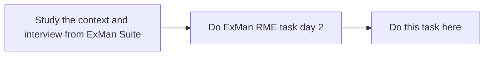

:::info Metadata
|Lecture equivalent| Duration |
|-|-|
|3| 2h 15min |

At the end of this task, students

* have derived container and component diagram from the ExMan Suite task
* have written the diagrams down with a tool of their choice
  - [draw.io](https://app.diagrams.net/) is the recommended way from a learning perspective
  - [PlantUML](/docs/tools/plantuml) is the way for explorers and avid learners

The goal of this task is to get to learn modelling with C4 and iterating a solution - **not** being correct in the first try.
:::

## Timing
As we had quite some lessons the last 3 weeks you also already have a lot of transfer work todo.

- [Client-Server](client-server)
- [Spring Starter](spring-starter)
- [Learning bite C4 model](bites/c4-model)

Finish them first before you attack the next exercise, this one. Also, you will need your RME transfer work from todays RME lesson, namely the use cases and the context diagram for the ExMan suite and packer. **This is DevOps, real engineering work.** You already combine knowledge and reuse content from RME which is what will also happen in practice! 

Your schedule for this task looks like:

You can also do them in parallel 🔥

Now you ask: **"How do I know my RME result is correct?"**

That is exactly the point. You do never know that in practice until you reviewed them with colleagues or seniors 💣 We do that together later!

## C4 Model

:::note Task
Watch this 📸
:::
<iframe width="560" height="315" src="https://www.youtube.com/embed/x2-rSnhpw0g" title="YouTube video player" frameborder="0" allow="accelerometer; autoplay; clipboard-write; encrypted-media; gyroscope; picture-in-picture" allowfullscreen></iframe>

## Context diagram
The context diagram from ExMan has been created within the RME context, also you got to learn in parallel of how the future ExMan **Suite** should look like. This gives us the perfect handover to our subject.

## Container diagram
In the [Learning bite C4 model](bites/c4-model) and in the lecture you have seen the first framework how to derive a container diagram from a context. You also have as input the results of your requirements engineering work.

:::note Task
With a tool of your choice, derive a container diagram.

- Note down your thoughts in a legend or paragraph below the document
  + You can also create a table to explain each container better
- Use [C4 Modeling](/docs/techniques/c4-modeling) as your guideline
- Do not be afraid to _make a mistake_ - never is an architecture **wrong**, there is just always room for improvement
- Maybe challenge your draft with a colleague at work or in school (e.g. your MA buddy)
  + If you find any corrections or obscurities, note them down and correct them
:::

## Component diagram

Your container diagram should contain something in the direction of a `Skill Service` (due to the fact that the ExMan Suite talk of `skills for employees`).

:::note Task
Zoom into your container diagram, preferably into the _skill area_ and try to derive a component diagram from it.

- Same bullets as for the container diagram apply
- Read the goal of this task again if you feel played, it is about tooling and experimenting!
- In case your container diagram does not contain anything related to skills, it might contain another container that does the _core_ work of your future architecture landscape
:::

## Sample solution

[Here](./solutions/c4-exman).
