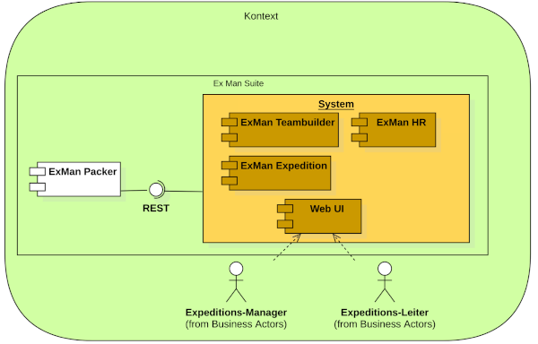
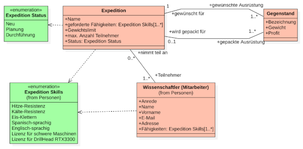

:::warning
You do not find this in the sidebar and you will not. You must earn your path here 👺
:::


## Context


This context is the result of RME work. It is the basis of the model we make below (together with further information from RME transfer tasks).

## Container diagram

```plantuml
@startuml ExMan Suite Containers
!include https://raw.githubusercontent.com/plantuml-stdlib/C4-PlantUML/master/C4_Container.puml
' comment change diagram
' left to right direction
' skinparam linetype ortho

Person(manager, "Expedition Manager", "Manages the company, hires employees and plans expeditions financially")
Person(leader, "Expedition Leader", "Guides an expedition, defines the requirements for it and selects participants and their equipment")
Person(admin, "Expedition Leader", "Guides an expedition, defines the requirements for it and selects participants and their equipment")

System_Boundary(c1, "ExMan Suite") {
    ContainerDb(db, "Database", "MySQL", "Persists (on disk) the expedition information")
    Container(exmanstarter, "ExMan API", "Java Spring", "Monolithic starter service coordinating expeditions and participants")
    Container(exmanweb, "ExMan Web App", "PHP/JS", "Web app to manage the expeditions of the company")
    Rel(exmanstarter, db, "Uses", "JDBC")
    Rel(exmanweb, exmanstarter, "Uses", "JSON/HTTPS")    
}
System_Ext(packer, "ExMan Packer", "External expedition packaging service")
System_Ext(auth, "Identity Provider", "External IDP providing Authentication and Authorization capabilities")

Rel(manager, exmanweb, "Uses", "HTTPS")
Rel(admin, exmanweb, "Uses", "HTTPS")
Rel(admin, exmanstarter, "Uses occasionally", "HTTPS")
Rel(leader, exmanweb, "Uses", "HTTPS")
Rel(exmanstarter, packer, "Consumes API", "HTTPS")
Rel(exmanstarter, auth, "Uses", "HTTPS")

center footer "Generated from code, ❤️ Everything as Code!"
@enduml
```

### Requirements

#### QR-003 UI
Covered with the `ExMan Web App` (which is not part of this lecture but more of _WEG (Web Engineering_).

#### QR-004 Location agnostic
`ExMan Web App` is a hosted web app, accessible from any location with access to the internet.

#### QR-004 Permission based
Permissions are managed from an external service `Identity Provider` (which one is to be defined later).

#### QR-002 Modularity
`ExMan API` starts out as monolith. In the current scope there is no advocation for using any for of microservices. The `ExMan API` is the domain owner of _expeditions_. This domain currently is small enough to not split the service up in any kind. Since it uses proper abstraction and hexagonal design it will not be problematic to split off some domains in future scenarios (e.g. HR component).

## Component diagram

`ExMan API` manages the following domain:




```plantuml
@startuml ExMan API Component
!include https://raw.githubusercontent.com/plantuml-stdlib/C4-PlantUML/master/C4_Component.puml
' comment change diagram
' left to right direction
' skinparam linetype ortho

AddElementTag("skill", $bgColor="orange")
AddElementTag("person", $bgColor="red")
AddElementTag("expedition", $bgColor="green")

ContainerDb(db, "Database", "MySQL", "Persists (on disk) the expedition information")
Container_Boundary(exmanapi, "ExMan API"){
  Component(signinController, "Sign In Controller", "Spring Rest Controller", "Allows users to sign-in")
  Component(signinService, "Sign In Service", "Spring Bean", "Allows users to sign-in, primarily using LinkedIn services")
  Rel(signinController, signinService, "Uses")
  Component(authClient, "Auth Adapter", "Spring Bean", "Connects to the IDP providing and validating tokens")
  Rel(signinService, authClient, "Uses")

  Component(expeditionController, "Expedition Controller", "Spring Rest Controller", "Manage expeditions, assign them skills and persons", $tags="expedition")
  Component(expeditionService, "Expedition Service", "Spring Bean", "Orchestrate business logic around expeditions", $tags="expedition")
  Component(expeditionRepository, "Expedition Repository", "JPA repository", "Store relevant expedition information", $tags="expedition")
  Rel(expeditionController, expeditionService, "Uses")
  Rel(expeditionService, expeditionRepository, "Uses")
  Rel(expeditionRepository, db, "uses", "JPA")

  Component(packerClient, "Packer Facade", "Spring Bean", "Abstracts external packaging service")
  Rel(expeditionService, packerClient, "Uses")

  Component(personController, "Person Controller", "Spring Rest Controller", "Manage persons and their privileges", $tags="person")
  Component(personService, "Person Service", "Spring Bean", "Provide person information (including their skill mapping)", $tags="person")
  Component(personRepository, "Person Repository", "JPA repository", "Store person information", $tags="person")
  Rel(personController, personService, "Uses")
  Rel(personService, personRepository, "Uses")
  Rel(personRepository, db, "uses", "JPA")

  Component(skillController, "Skill Controller", "Spring Rest Controller", "Create, update or delete skills", $tags="skill")
  Component(skillService, "Skill Service", "Spring Bean", "Provide skill logic to other services and the controller", $tags="skill")
  Component(skillRepository, "Skill Repository", "JPA repository", "Store skill information", $tags="skill")
  Rel(skillController, skillService, "Uses")
  Rel(skillService, skillRepository, "Uses")
  Rel(skillRepository, db, "uses", "JPA")

  Rel(expeditionService, personService, "Uses")
  Rel(expeditionService, skillService, "Uses")
}
Container(exmanweb, "ExMan Web App", "PHP/JS", "Web app to manage the expeditions of the company")

System_Ext(packer, "ExMan Packer", "External expedition packaging service")
System_Ext(auth, "Identity Provider", "External IDP providing Authentication and Authorization capabilities")
Rel(packerClient, packer, "Consumes API", "HTTPS")
Rel(authClient, auth, "Uses", "HTTPS")
Rel(personService, auth, "Could use")

' Web Access
Rel(exmanweb, signinController, "Uses", "JSON/HTTPS")
Rel(exmanweb, expeditionController, "Uses", "JSON/HTTPS")
Rel(exmanweb, personController, "Uses", "JSON/HTTPS")
Rel(exmanweb, skillController, "Uses", "JSON/HTTPS")

center footer "Generated from code, ❤️ Everything as Code!"
@enduml
```

### Explanations

#### Monolithic approach
The current domain could be split up into the domains `Skill`, `Person` and `Expedition`. While this is architecturally a perfect and legit option, for the skill set of our developers its not. Also, the current scope is yet too small to already split the service up. The overhead of writing three APIs between the services is additionally luring us away from a microservice architecture.

> Split the monolith!

If one sleeps over the tipping point of a monolith split, one pays an enormous price. To avoid this disaster we take the following risk mitigation:

* Proper and strict isolation of contexts (separation of concerns) allow an easier split later - no 🍝 code, no randomly calling other out-of-layer entities
  + Code reviews and pair programming will ensure that contexts are not violated
* Hexagonal architecture provides us means to later exchange a _DB repository_ with a _remote repository_ fetching skills instead from a DB from another service
* Regular reviewing and challenging of the decision to stay with the monolith or split (upon every introduction of a new feature) - the management is to be made aware of this upcoming architectural change one day

:::note 💡
For educational purposes the future domains and their isolation within our `monolith` are separated by colors. This is not _normal_ to do but should point out how each domain is within itself isolated. As hexagonal architecture _suggests_ dependencies flow inward, meaning that only at service level (logic layer) we will allow cross-service communication.
With that we can later take one domain, split it into a microservice but maintain 80% of our architecture thanks to proper _isolation_.
:::

:::note 💡
For educational purposes the isolation and separation is quite verbose (it resembles quite a class diagram already). This verbosity could be abstracted in practice maybe a bit to reduce overhead.
:::