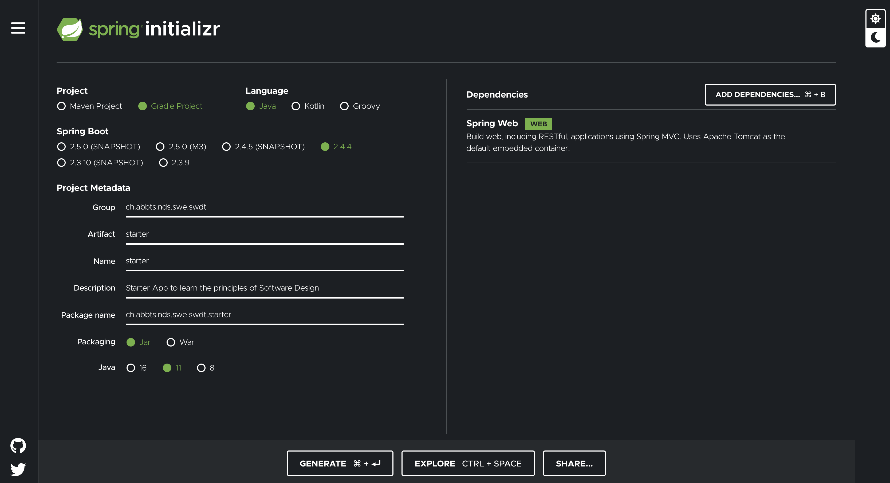
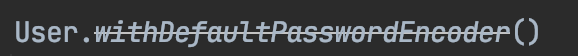

:::info Metadata
|Lecture equivalent| Duration |
|-|-|
|5| 3h 45min |

At the end of this task, students

* have setup a spring starter app
* have added a secured endpoint to their starter
* have built a container image with their starter within
* have checked all of the above into git
* have (optionally) added a Dependabot Config to their starter
:::

In the class you have cloned a the pre-made starter [nds-swe/spring-starter](https://github.com/nds-swe/spring-starter).

To create this starter the following steps have been performed:

1. Use [start.spring.io](https://start.spring.io/) to create the Web Application template. Note that you can add the `Spring Web` dependency there already.
2. Glance into these [1](https://spring.io/guides/gs/spring-boot/), [2](https://www.jetbrains.com/help/idea/your-first-spring-application.html#what-next) tutorials to learn the basics.


<small>Caution, images are not from code, they might get deprecated!</small>

:::note Task
Invest into your own starter! Clearly you can just take the sample and claim it yours 👺, but, how much will you have learned about dependencies, annotations and Spring then?
:::

## Spring
You can read a [small introduction to Spring from the NDS side](/docs/tools/spring) in the tools section.

## Starter App
In the lecture we have analysed the application once already. A key skill of an engineer is to be able to dive into someone elses code.

The starter (also the freshly downloaded one from [start.spring.io](./assets/start-spring-io.png)) contains the following files (shortened for brevity):

```
.
├── build.gradle
├── gradle
│   └── ...
├── ... more gradle stuff
└── src
    ├── main
    │   ├── java
    │   │   └── ch
    │   │       └── abbts
    │   │           └── nds
    │   │               └── swe
    │   │                   └── swdt
    │   │                       └── starter
    │   │                           └── StarterApplication.java
    │   └── resources
    │       ├── application.properties
    │       └── ...
    └── test
        └── java
            └── ch
                └── abbts
                    └── nds
                        └── swe
                            └── swdt
                                └── starter
                                    └── StarterApplicationTests.java
```

:::note Task
Understand the content of the following files 

* `StarterApplication.java` in parent directory `src/main`
* `StarterApplicationTests.java` in parent directory `src/main`
* `build.gradle` in `.`

With understand it is meant that you actually know for **each** line what it does and why it exists.

You find a sample solution in the next task.
:::

### Run
If your app runs smoothly, you should see something like:

```
2021-04-03 21:01:04.048  INFO 64739 --- [main] c.a.n.s.swdt.starter.StarterApplication  : Starting StarterApplication using Java 14.0.2 on C02Y91DDJGH6 with PID 64739 (/Users/i511895/SAPDevelop/abb/spring-starter/build/classes/java/main started by i511895 in /Users/i511895/SAPDevelop/abb/spring-starter)
2021-04-03 21:01:04.051  INFO 64739 --- [main] c.a.n.s.swdt.starter.StarterApplication  : No active profile set, falling back to default profiles: default
2021-04-03 21:01:04.743  INFO 64739 --- [main] o.s.b.w.embedded.tomcat.TomcatWebServer  : Tomcat initialized with port(s): 8080 (http)
2021-04-03 21:01:04.752  INFO 64739 --- [main] o.apache.catalina.core.StandardService   : Starting service [Tomcat]
2021-04-03 21:01:04.752  INFO 64739 --- [main] org.apache.catalina.core.StandardEngine  : Starting Servlet engine: [Apache Tomcat/9.0.44]
2021-04-03 21:01:04.802  INFO 64739 --- [main] o.a.c.c.C.[Tomcat].[localhost].[/]       : Initializing Spring embedded WebApplicationContext
2021-04-03 21:01:04.802  INFO 64739 --- [main] w.s.c.ServletWebServerApplicationContext : Root WebApplicationContext: initialization completed in 705 ms
2021-04-03 21:01:04.934  INFO 64739 --- [main] o.s.s.concurrent.ThreadPoolTaskExecutor  : Initializing ExecutorService 'applicationTaskExecutor'
2021-04-03 21:01:05.073  INFO 64739 --- [main] o.s.b.w.embedded.tomcat.TomcatWebServer  : Tomcat started on port(s): 8080 (http) with context path ''
2021-04-03 21:01:05.080  INFO 64739 --- [main] c.a.n.s.swdt.starter.StarterApplication  : Started StarterApplication in 1.398 seconds (JVM running for 1.93)
```

:::note Task
Study this log, line by line and reflect what these messages signal!
<details><summary>Sample solution</summary>
<a href="https://github.com/nds-swe/spring-starter/releases/tag/sample-solution-1.0.0" target="_blank">Sample solution</a>
</details>
:::

## Adding and securing endpoints

In order to secure your endpoint you now need to start reading the code and understand what it tries to do.

:::danger
This code is miles apart from what you did in the first semester in ALG and OOP. Chances that you meet simple and literally trivial code in production are super small.
Try to understand the engineering approaches taken or visit any of the communities!
:::

### Adding an insecure REST endpoint
It is a rare occasion that I write tutorials myself due to the danger of deprecation. As securing a REST API is a monstrous topic, I break it down into a few bits to consume. The official guidance would be on [spring.io/guides](https://spring.io/guides/tutorials/rest/).

The app above does not yet feature any endpoint, it is an empty framework. Let us add one.

Create a file `ch/abbts/nds/swe/swdt/starter/EmployeesController.java` and add the following content:

```java
package ch.abbts.nds.swe.swdt.starter;

import org.springframework.web.bind.annotation.GetMapping;
import org.springframework.web.bind.annotation.RequestMapping;
import org.springframework.web.bind.annotation.RestController;

import java.util.Arrays;
import java.util.List;

@RestController
@RequestMapping(path = "/employees")
public class EmployeesController {
  @GetMapping(path = "/", produces = "application/json")
  public List<String> employees() {
    return Arrays.asList(new String[]{
        "Tenzing Norgay",
        "Edmund Hillary",
        "These names",
        "should never be available",
        "to anonymous users!"
    });
  }
}
```
:::note Task
Investigate this file using Google and answer the following four control questions:

* What does `@RestController` do?
* What will be the answer when calling `GET /employees/` and why?
* Why is the response a `Arrays.asList`?
* Does Spring still work, if you name the file `MyController1.java`? If yes, why?

:::

As we said, understanding this requires advanced skills, many of them we will learn later in this lecture!

### Adding a to-be secure REST endpoint

```java
...
@RestController
@RequestMapping(path = "/employees-secure")
...
```
:::note Task
Repeat the previous step but intend the endpoint to become secure! 

**In practise we do not name any endpoint `secure`, this is just for the first time and for the demo!** There are only very few endpoints ever to be made public (e.g. a version info endpoint).
:::

We will now secure this endpoint!

### Securing an endpoint

Create a new file `ch/abbts/nds/swe/swdt/starter/CustomWebSecurityConfigurerAdapter.java`:

```java {9,10,11,12,13,20}
// package and imports omitted for brevity
@Configuration
@EnableWebSecurity
public class CustomWebSecurityConfigurerAdapter extends WebSecurityConfigurerAdapter {
  @Override
  protected void configure(HttpSecurity http) throws Exception {
    http
        .csrf().disable()
        .authorizeRequests()
        .antMatchers("/employees/**").permitAll()
        .anyRequest().authenticated()
        .and()
        .httpBasic();
  }

  @Bean
  @Override
  public UserDetailsService userDetailsService() {
    UserDetails user =
        User.withDefaultPasswordEncoder()
            .username("user")
            .password("password")
            .roles("USER")
            .build();

    return new InMemoryUserDetailsManager(user);
  }
}
```

:::note Task
Secure the endpoint as described above. Answer the following questions carefully:

* Why does IntelliJ cross out this word (the highlighted line)?



* What do the highlighted lines do?

<details><summary>Sample solution</summary>
<a href="https://github.com/nds-swe/spring-starter/releases/tag/0.1.1" target="_blank">Sample solution</a>
</details>
:::

## Recap
Until now we have finished our spring app (with the web plugin) and added an insecure and a secure endpoint to it. We did this with a starter and 3 new files. We reuse what others do best and have produced a nearly **production-grade** app.

There is three small issues at the moment: 

1. Our app does not yet do too much - we will fix that later in the lecture
2. Our app uses a non-production grade authentication - this is fine for now, we learn an [`E` profile](/docs/guiding-thread#profiles), we draw the line here for now and will improve it later, for now it is secure enough
3. Our app is not conveniently deployable - we also want to produce an usable artifact 👇🏼

## Building docker
In the lecture today we have refreshed our [docker](/docs/tools/docker) knowledge. Time to put it under test.

_Hint_: You need a `build`(built) app for the image. The build step is also explained in the tutorial linked on the next line but it should be present from [past lecture _BSY_ (gradle)](/docs/expectations#-gradle).

:::note Task
_Dockerize_ your application, either you figure it our after todays lesson or use the [official tutorial](https://spring.io/guides/gs/spring-boot-docker/).

<details><summary>Sample solution</summary>
<a href="https://github.com/nds-swe/spring-starter/releases/tag/0.1.1" target="_blank">Sample solution (check the Dockerfile)</a>
</details>
:::

Some minor remarks:

* The tutorial also optimizes build performance in the last step, we skip that for now
* You should use a separate user to run the spring app, it increases the security even further - how you can do that is described in the tutorial and shown in the sample solution.


## Push
:::note Task
Push the result to a GitHub repository of your choice and hand in the repository URL via a comment on [this discussion](https://github.com/nds-swe/spring-starter/discussions/2).
:::

## Dependabot
If you made it that far in time, congratulations 🎉. If not, this task is optional or for the interested ones.

It is very tedious to keep dependencies up to date. We could implement some algorithm to solve that... ... ... ... NO! [DRY](/docs/theory/principles#do-not-repeat)! Someone must have done that! **Correct**.

[Dependabot](https://dependabot.com/) is capable of maintaining our dependencies for us! Pay it - the bot - a visit (here is the [how to](https://dependabot.com/#how-it-works)) and add it to your project!

Here are its [official docs](https://docs.github.com/en/code-security/supply-chain-security/enabling-and-disabling-version-updates)!

<details><summary>Here is a sample solution 😉</summary>
<a href="https://github.com/nds-swe/spring-starter/releases/tag/0.1.1" target="_blank">Sample solution (check the .github folder)</a>
</details>
