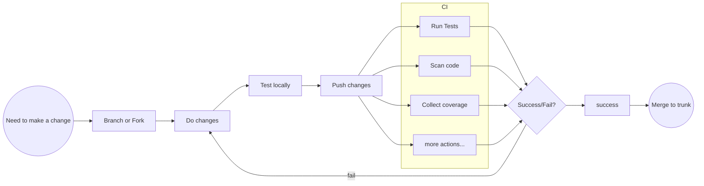

Never before was CI so simple as it is today thanks to [GitHub Actions](/docs/tools/github-actions).

:::info
I do not get paid by GitHub, Actions are just 😍🤩 They make your life so much easier (as you will learn)!
:::

There are hundreds if not thousands of articles around Continuous Integration and its surroundings. In the end we can boil it down to a simple process.

The diagram is not yet looking too great, sadly there is [no direction support yet](https://github.com/mermaid-js/mermaid/issues/1265) in sub-graphs 😊

One can see in the yellow subgraph that we do check our new change with various steps if it is indeed ready to be merged to the `trunk` (the trunk is the main branch of our work - what gets deployed to production).

We use [GitHub Actions](/docs/tools/github-actions) to transfer this technique into practice.