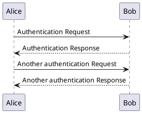

🔗 [plantuml.com](https://plantuml.com/)

PlantUML can be summarized as _declarative diagrams_ or _domain specific language (DSL)_. I tend to call it `Diagrams As Code` for simplicity although this is not 100% _technically_ correct.

PlantUML takes some code like this:

```
@startuml
Alice -> Bob: Authentication Request
Bob --> Alice: Authentication Response

Alice -> Bob: Another authentication Request
Alice <-- Bob: Another authentication Response
@enduml
```

And converts it to this



Within our docs and it is even more elaborate thanks to [docusaurus.io](https://docusaurus.io/),[mdxjs.com](https://mdxjs.com/) and the [remark-plugins](https://www.gatsbyjs.com/plugins/gatsby-remark-plantuml/). The community does amazing things ❤️

Note that PlantUML does not look extremely pretty, but I am willing to pay any price to have maintainable, versioned, in-code diagrams! The two times a month we check the diagrams PlantUML or its alternatives **definitely** do their job!

## In short

PlantUML (or its alternatives) take declarative code and convert it to an image of some form. It is like the `.svg` file format - except that it describes a diagram instead of an _image_.

:::success Online Server
They have an [online server](http://www.plantuml.com/plantuml/uml/SyfFKj2rKt3CoKnELR1Io4ZDoSa70000) to start even!
:::

## Usage
We use it primarily for [C4 Modeling](/docs/techniques/c4-modeling). Note that I do not imply on the/you students that you use PlantUML, everyone can drink their own soup 🍜

## Alternatives

* [Mermaid.js](https://mermaid-js.github.io/mermaid/#/)