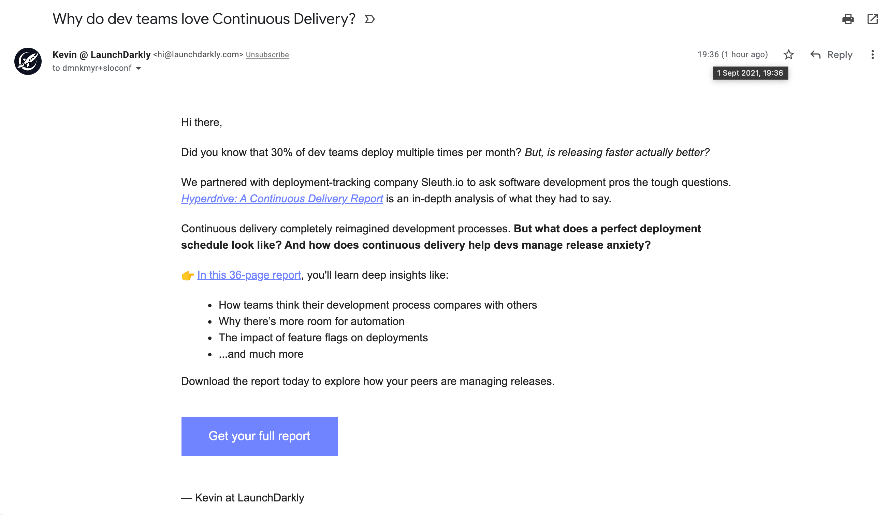
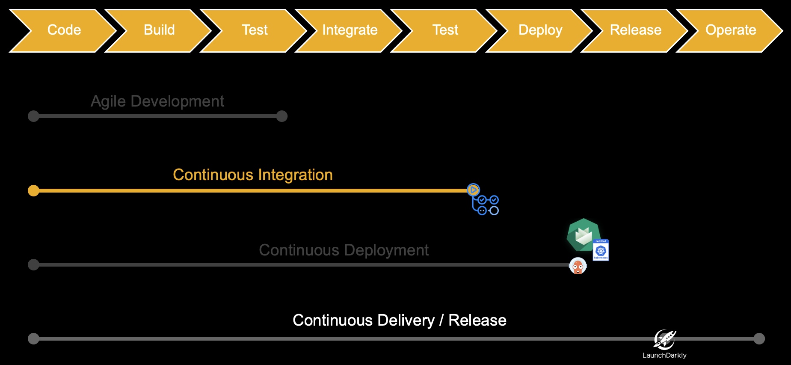

## Ziel

> Die Studierenden ordnen ihre Anwendung dem Continous Delivery Modell zu.

> Die Studierenden werten die Anwendung eines Feature Flag Services aus und qualifizieren dessen Anwendung.

---

## 🎒 Ressourcen aktivieren

- Applikation in Container
- [Kontinuierlich integriert](/swdt/docs/techniques/continuous-integration)
- Deployment Fach CCT
---
- Erklär mal jemand, warum ist `deploy` vor `release`
  + Feature Toggles/Flags/Switches
- Continuous Delivery/Deployment/Release
---

--

## Toggles, Flags, Switches oder Tüdelü?

Alles das gleiche.

---

## Agenda

Drücke _Esc_ 🔘

---

## Transferaufgabe

[Aufgabe](/swdt/tasks/swagger)

---

## Feature Flags

--

# 🎥

--

LaunchDarkly war in unserem Fall [unleash](https://docs.getunleash.io/).

--

## Was jetzt?

- Feature Toggles As A Service
  + Kostet
  + Je nach Grösse wert
  + Harte Abhängigkeit
    * SLA
    * Caching/Fallback
- Selber hosten
  + Kosten gegen Wartungsaufwand/Zeit
  + Evtl. flexibler
- Nicht nutzen
  + _Wird nicht weiter diskutiert_

--

## In der MA oder DA?

Möglich, aber sicher _Zucker_ 🍰🍡.

-- 

## Wie geht das?

- Feature Toggles werden von einem Server verwaltet
- Boolean Werte mit viel Schnick-Schnack darum
- Toggles meist nutzerbasiert
  + Besucht User `A` die Seite, sieht er 💚
  + Besucht User `B` die Seite, sieht er ❤️
  + kann auch bei API Aufruf sein (wie in der Demo) 

--

## Modi

- **Separate Deployment and Release**
- Early Preview
- A/B Test
- Canary Release (Rolling rollout)
- Free/Gold/Premium

---

## Mehr lesen

- [martinfowler.com/.../feature-toggles](https://martinfowler.com/articles/feature-toggles.html)
- [launchdarkly.com/.../what-are-feature-flags/](https://launchdarkly.com/blog/what-are-feature-flags/)
- [www.atlassian.com/.../feature-flags](https://www.atlassian.com/continuous-delivery/principles/feature-flags)

---

## StarFish Feedback

Was kann ich nächstes Jahr persönlich besser machen?

[LinkedIn](https://www.linkedin.com/in/meyerdominik/)