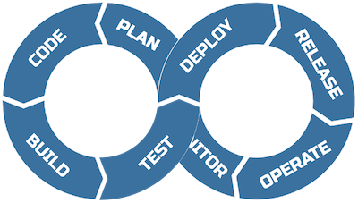
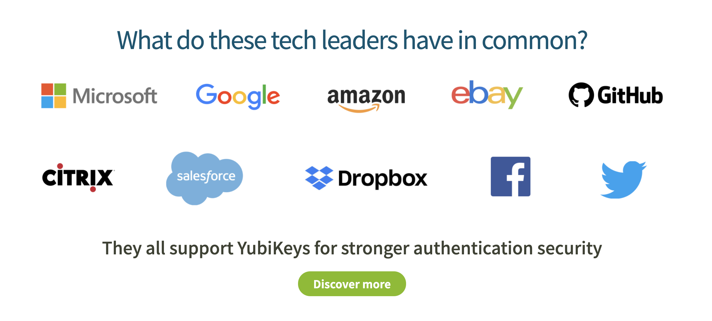

## Ziel

> Nach der Lektion werten die Studierenden Metriken aus und observieren bzw. werten ihre Applkation mittels Telemetriedaten.

---

## 🎒 Ressourcen aktivieren

- Applikation, in Container, **mit Logs**
- Fortlaufend dokumentiert
- _Evtl._ Datenbankanbindung
---
- Überwachen der Applikation
  + `Logging` - Level 1, etwas ist bereits passiert
  + `Observability` - Level 2, was passiert gerade
---

---

## Agenda

Drücke _Esc_ 🔘

---

## Bite
Lösen Sie nun den Bite [Telemetry](/tasks/bites/telemetry).

---

## _Beobachtbarkeit_

Observability

--

### User Story

> Als Betreibende wollen wir zu jedem Zeitpunkt, vor- und zurückblickend, unsere Applikation beobachten und Telemetriedaten erhalten, so dass wir Anomalien erkennen und frühzeitig Massnahmen ergreifen können.

--

<small>[src](https://www.aircraft.cleaning/downloads/aircraft-cockpit-flight-deck-cleaning.jpg)</small>

--

### [Prometheus](https://prometheus.io/)
[OpenTelemetry](https://opentelemetry.io/)

> Power your metrics and alerting with a leading
open-source monitoring solution. _- [prometheus.io](https://prometheus.io/)_

--

### Demo

Let me show you some examples 😏

---

## Einschub: MFA
[YubiKey](https://www.yubico.com/)

---

## Zielkontrolle
[Forms](https://forms.office.com/r/CmYe6dPtaD)
<iframe width="800px" height= "600px" src= "https://forms.office.com/Pages/ResponsePage.aspx?id=jFPvG7jqjkuUpxxjUwRM1taP9lZk89lOp6y30fgL2sRUM1VXU1ZVOTMwOVhPRTRES0k4UkJXUklaWS4u&embed=true" frameborder= "0" marginwidth= "0" marginheight= "0" style= "border: none; max-width:100%; max-height:100vh" allowfullscreen webkitallowfullscreen mozallowfullscreen msallowfullscreen> </iframe>

---

## Ressourcen
Lernen Sie mehr über:

- die [Cloud Native Computing Foundation](https://www.cncf.io/)
- [kubernetes](https://kubernetes.io/) mit dem [Kubernetes Podcast](https://kubernetespodcast.com/)
- [thanos.io](https://thanos.io/) - hoch-verfügbarer, lang-lebiger Prometheus Setup
- [cortexmetrics.io](https://cortexmetrics.io/) - hoch-verfügbarer, lang-lebiger Prometheus Setup mit etwas mehr Features 🤣
