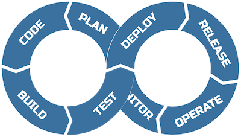
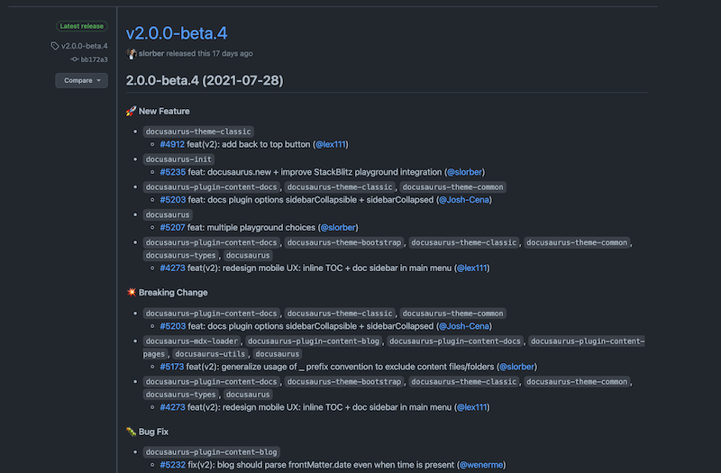
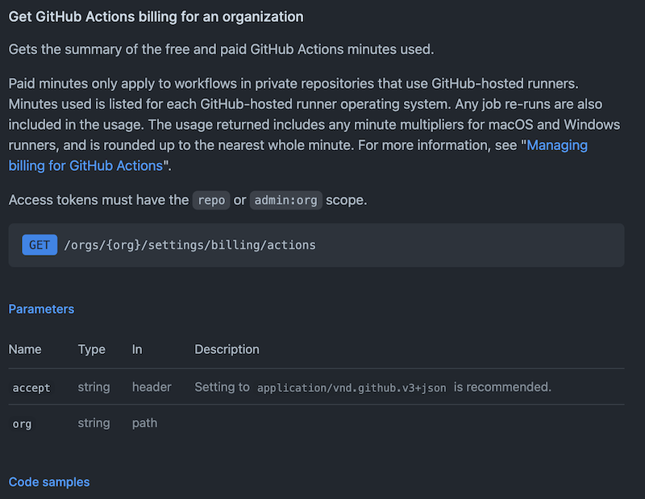

## Ziel

> Nach der Lektion haben die Studierenden die `sping-starer` API mit Swagger-UI dokumentiert.

> Nach der Lektion begründen die Studierenden die Anwendung von _Release Notes_ oder _Changelogs_ und wenden diese in ihrem Projekt an.

---

## 🎒 Ressourcen aktivieren

- Applikation in Container
- Vision und Ziele
---
- Dokumentation
- Transparenz
- Nachverfolgbarkeit
---

---

## Agenda

Drücke _Esc_ 🔘

---

## Transferaufgabe

[Aufgabe](/swdt/docs/tasks/database)

---

## Changelog

Unsere Arbeit verfolgbar dokumentieren.

--

### User Story
Als Entwickelnde wollen wir Änderungen an unserem Produkt nachvollziehbar dokumentieren, so dass interne und externe Beobachtende unseren Änderungen folgen können ohne den Code zu analysieren.

--

### Example Docusaurus Release Notes
[docusaurus/releases](https://github.com/facebook/docusaurus/releases)

...

--

### Changelog `vs` Release Notes
[SO article](https://stackoverflow.com/questions/51621400/what-is-difference-between-release-notes-and-changelog)

Release Notes
- Für Kunden
- Zusammenfassung von
  + Features
  + Bug Fixes
  + weiterem
- Was hat neben der offiziellen Dokumentation geändert?
- Für Produkte mit visuellen Aspekten geeignet

--

### Changelog
- Sehr genaue und komplette Liste
- Chronologisch geordnet
- Spezifisch und z.T. implementierende Person verlinkt
- Für Bibliotheken u.U. besser geeignet

--

### Welches jetzt?

Für _MA_, _DA_ wären Release Notes (von Hand geschrieben) schön. Im Falle einer Bibliothek oder einer reinen API könnte ein Changelog reichen.

--

### Automatisiert?
Möglich! Aber _schwer_.

Braucht enorme `git`-flow Disziplin und akribische `git`-Messages.

Für _MA_, _DA_ sicher zu viel.

--

### Standards & Links
- [keepachangelog.com](https://keepachangelog.com/en/1.0.0/)
- [semver.org](https://semver.org/)
---
- [The art of writing great release notes](https://uxdesign.cc/the-art-of-writing-great-release-notes-6607e22efae1)

---

## API Dokumentation

Gute User Interfaces brauchen nicht viel oder keine Dokumentation, siehe Spotify, Netflix etc.

Eine API hingegen ist schwieriger zu verstehen.

--

### API Docs
[docs.github.com/.../billing](https://docs.github.com/en/rest/reference/billing)

...

-- 

### Docs schreiben

Von Hand --> ⚰️
Wir nutzen - richtig - eine Library dafür!

Wir wollen uns an den [OpenAPI Standard](https://swagger.io/specification/) halten.

Dazu gibt es [Swagger](https://swagger.io/) oder [Spring REST Docs](https://spring.io/projects/spring-restdocs#overview).

--

### [OpenAPI 3.0.3](https://swagger.io/specification/)

> The OpenAPI Specification (OAS) defines a standard, language-agnostic interface to RESTful APIs which allows both humans and computers to discover and understand the capabilities of the service without access to source code, documentation, or through network traffic inspection. When properly defined, a consumer can understand and interact with the remote service with a minimal amount of implementation logic.

--

### Achtung!

OpenAPI gibt uns nur ein `.yaml`!

Wir wollen aber ein User Interface. Auch dafür hat Swagger eine Lösung!

--

### Andere Sprachen

**PHP**
- [swagger-php](https://github.com/zircote/swagger-php)

**GO**
- [go-swagger](https://github.com/go-swagger/go-swagger)
- [swaggo/swag](https://github.com/swaggo/swag)

--

### Swagger für Java
[Tutorial](https://www.baeldung.com/spring-rest-openapi-documentation)

---

## Bite
Lösen Sie nun den Bite [Swagger](/swdt/docs/tasks/bites/swagger).

---

## Zielkontrolle
Ende nächster Lektion.